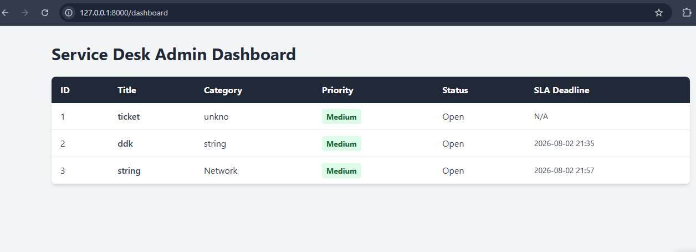

# Ticket Automation System 

An ITIL-aligned, automated Service Desk backend and administrative dashboard designed to streamline incident management, enforce SLAs, and accelerate technical troubleshooting.

## Key Features

*   **ITIL Incident Routing:** Priority-based categorization for Network, Hardware, and Software issues.
*   **Automated SLA Enforcement:** Dynamically calculates service level agreement deadlines based on ticket criticality (e.g., Critical issues receive a strict 2-hour resolution window).
*   **Automated Network Diagnostics:** When a "Network" ticket is submitted, the backend automatically executes Ping and DNS resolution scripts (`subprocess`, `socket`), appending the diagnostic telemetry directly to the ticket to save agents time.
*   **Admin Dashboard:** A responsive, real-time UI built with Jinja2 and Tailwind CSS for IT agents to monitor queue health and SLA statuses.

## Technology Stack

*   **Backend:** Python, FastAPI, Pydantic
*   **Database:** SQLite, SQLAlchemy ORM
*   **Frontend:** HTML5, Tailwind CSS, Jinja2 Templates
*   **Systems:** Windows Event Subprocess, ICMP/DNS Routing

## Dashboard Preview
 

## Local Setup Instructions

1. Clone the repository:
   ```bash
   git clone https://github.com/Aaysh1702/it-service-desk.git
